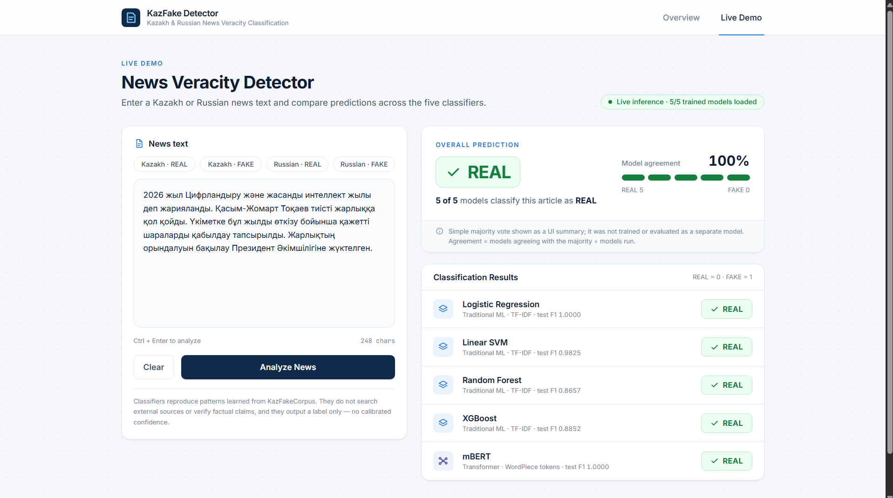
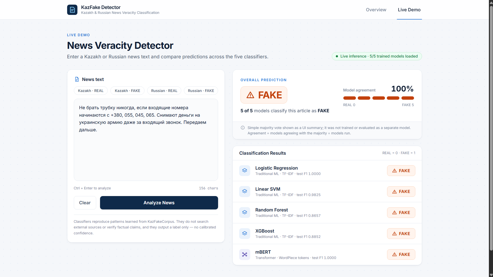

# KazFake Detector

**Kazakh & Russian News Veracity Classification**: a comparison of traditional machine learning and a transformer for binary REAL / FAKE news classification on [KazFakeCorpus / news-veracity-corpus](https://github.com/Anargul-Aimuratovna/news-veracity-corpus) (CC BY 4.0).

The repository has three parts: the original experiment, the trained-model export, and a two-page web demo (Overview and Live Demo).

> This is news-veracity *classification* learned from a corpus. It does not search external sources or verify factual claims, and it is not a fact checker.

## Screenshots

### Overview


### Live Demo

**Texts from the corpus test split** (not seen during training):

| REAL · Kazakh | FAKE · Russian |
|---|---|
|  |  |
| 5 of 5 models: REAL | 5 of 5 models: FAKE |

**New texts written for testing** (not in the corpus):

| REAL-style · Russian | FAKE · Kazakh |
|---|---|
|  |  |
| 4 of 5 models: REAL (Random Forest: FAKE) | 5 of 5 models: FAKE |

On new texts the models respond mostly to writing style. A formal, news-agency tone leans REAL, and urgency, capital letters and "share this" phrasing lean FAKE, whether or not the claim is actually true.

## Models

1. Logistic Regression
2. Linear SVM (`LinearSVC`)
3. Random Forest
4. XGBoost
5. multilingual BERT (`bert-base-multilingual-cased`, fine-tuned)

Labels: `REAL = 0`, `FAKE = 1`.

## Pipeline

```
Traditional:  Text → Cleaning → TF-IDF (word 1–2-grams, ≤10k features, min_df=2, sublinear tf) → Classifier → REAL/FAKE
Transformer:  Text → Cleaning → mBERT tokenization (max 256) → mBERT → Classification head → REAL/FAKE
```

Both branches use the same cleaning function and the same stratified 80/20 split (`random_state=42`). mBERT is fine-tuned for 3 epochs with learning rate 2e-5 and a training batch size of 8.

## Results (held-out test split)

| Model | Accuracy | Precision | Recall | F1 |
|---|---:|---:|---:|---:|
| Logistic Regression | 1.0000 | 1.0000 | 1.0000 | 1.0000 |
| Linear SVM | 0.9821 | 1.0000 | 0.9655 | 0.9825 |
| Random Forest | 0.8393 | 0.7632 | 1.0000 | 0.8657 |
| XGBoost | 0.8750 | 0.8438 | 0.9310 | 0.8852 |
| mBERT | 1.0000 | 1.0000 | 1.0000 | 1.0000 |

Logistic Regression and mBERT both reached 100% on the held-out test split used in this experiment. This describes this split only. It is not a guarantee of performance on unseen real-world news.

## Project layout

```
backend/            FastAPI inference API
  main.py           GET /api/health, POST /api/predict
  inference.py      loads saved artifacts once, runs all five models
  preprocessing.py  verbatim copy of the training clean_bilingual_text()
  models/           artifacts written by the training script (git-ignored)
frontend/           React + Vite + TypeScript + Tailwind + Recharts
training/
  original_pipeline.py   the experiment (= code.py) + section 5.2 "Save Trained Models"
code.py             original script, unchanged
```

## Running

Requirements: Node 18+ and Python 3.10+.

**1. Frontend**

```bash
cd frontend
npm install
npm run dev            # http://localhost:5173  (proxies /api to :8000)
npm run dev:demo       # same, but forces demo mode (no backend needed)
```

**2. Backend**

```bash
cd backend
pip install -r requirements.txt
uvicorn main:app --port 8000
```

The backend only loads saved models and never retrains. Each model loads independently: without `torch`/`transformers` or the `models/mbert` folder, the four TF-IDF models still work and mBERT is shown as "not loaded".

**3. Optional: train and export the models**

```bash
cd training
pip install -r requirements.txt
python original_pipeline.py
```

This runs the original experiment unchanged. It clones the corpus if needed, then writes the following to `backend/models/`:

- `tfidf_vectorizer.joblib`, `logistic_regression.joblib`, `linear_svm.joblib`, `random_forest.joblib`, `xgboost.joblib`
- `mbert/` (fine-tuned model + tokenizer, Hugging Face format)
- `run_metrics.json` (metrics of that run) and `test_split.json` (held-out texts + gold labels)

On CPU the mBERT fine-tuning takes roughly 10–15 minutes. Restart the backend afterwards.

> Run Python from inside `training/` or `backend/`, not the project root. The root's `code.py` shadows Python's standard-library `code` module, which breaks `import torch`.

## Demo mode

The Live Demo page picks its mode on load:

| Situation | Mode |
|---|---|
| Backend reachable and at least one model loaded | **Live inference** (green badge) |
| Backend down or no artifacts | **Demo mode** (amber badge) |
| `VITE_DEMO_MODE=true` (`npm run dev:demo` or `frontend/.env`) | **Demo mode**, forced |

Demo mode only answers for the four built-in examples, using fixed outputs stored separately in `frontend/src/lib/demoFixtures.ts`. Any other text gets a message asking you to start the backend. Predictions are never generated randomly.

The four examples are genuine texts from the corpus's held-out test split (one per language × label), shown with their gold label and source.

## Notes on what the UI shows

- **No confidence percentages.** The models return a label only. `LinearSVC` has no calibrated probabilities, so none are shown.
- **Overall prediction / agreement** is a simple majority vote over the models that ran (agreement = models agreeing with the majority ÷ models run). It is a UI summary, not an evaluated ensemble.
- **Data actually used by the pipeline.** The column auto-detection in `standardize_dataframe` matches `TEXT`/`Class` in `data/external_validation_set.json`. The main Label Studio export keeps its labels inside nested annotations, so its rows are dropped. The experiment therefore trains and tests on those 280 texts (146 FAKE / 134 REAL): 224 training texts and 56 test texts.
